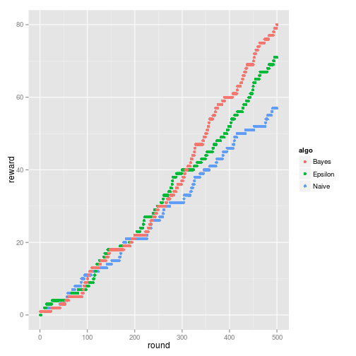

## Multi-armed-bandit problem
> In probability theory, the **multi-armed bandit problem** is the problem a gambler faces at a row of slot machines, sometimes known as "one-armed bandits", when deciding which machines to play, how many times to play each machine and in which order to play them. When played, each machine provides a random reward from a distribution specific to that machine. The objective of the gambler is to maximize the sum of rewards earned through a sequence of lever pulls.

### Aims of this presentation
> 1. Present two possible solutions to this problem.
> 2. Compare them using real data.

--- .class #id 

## General logic

1. Set wins and loses of all arms to 1 (`prior distribution`)
2. Run function which takes prior wins and loses as input and outputs an arm to pull
3. Pull that arm and update its wins and loses (`posterior distribution`)
4. Go back to step 2 and repeat


We will call logic with `mab` function. Following is an example of algorithm which always pulls first arm.

```r
arm_probs = c(0.05, 0.1, 0.2)   # arm true probabilities (unobserved)
game_rounds = 400       # number of rounds to play
which_arm = (function(posterior) sample(1:3,1))   # function which chooses an arm by random
reward_naive = mab(which_arm, arm_probs, game_rounds)
cat('Total reward', sum(reward_naive))
```

```
## Total reward 57
```

---

## Epsilon-greedy strategy
The best lever is selected for a proportion $1 - \epsilon$ of the trials, and a lever is selected at random (with uniform probability) for a proportion $\epsilon$.


```r
epsilon_greedy = function(posterior, epsilon=0.1){
  if(epsilon < runif(1)){
    return(sample(1:length(posterior), 1))
  } else {
    return(which.max(lapply(posterior, function(e) e[1] / (e[1] + e[2]))))
  }
}
reward_eps = mab(epsilon_greedy, arm_probs, game_rounds)
cat('Total reward from epsilon-greedy', sum(reward_eps))
```

```
## Total reward from epsilon-greedy 71
```

---

## Bayesian bandits
An idea of bayesian bandit is that number of pulls for a given lever should match its actual probability of being the optimal lever.


```r
bayesian_bandit = function(posterior){
  p = c()
  for(arm in posterior){
    p = c(p, rbeta(1, arm[1], arm[2]))
  }
  return(which.max(p))
}
reward_bayes = mab(bayesian_bandit, arm_probs, game_rounds)
cat('Total reward from bayesian bandits', sum(reward_bayes))
```

```
## Total reward from bayesian bandits 80
```

---

## Comparison


